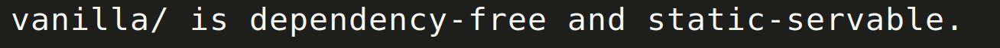
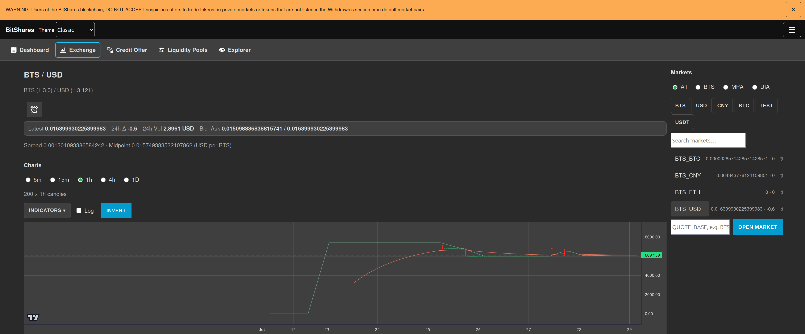
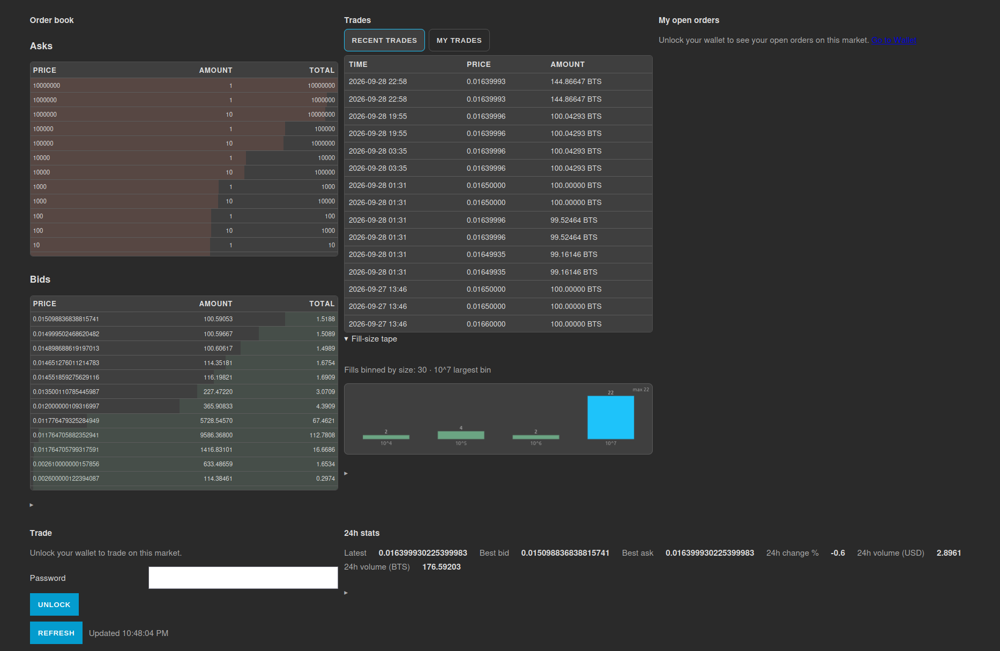
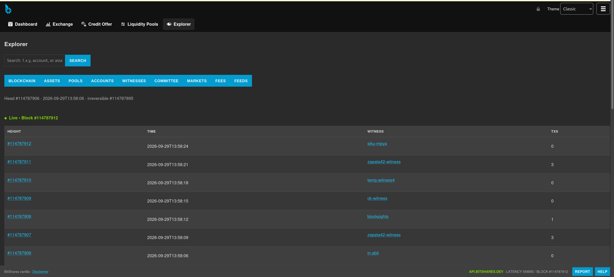

# BitShares Vanilla UI


> `bitshares-vanilla-ui` — a plug-and-play replacement for the BitShares
> reference wallet (`wallet.bitshares.org`), written in plain HTML +
> JavaScript + CSS with **zero runtime dependencies**.



No React, no bundler, no `npm install` to run it — serve the `vanilla/`
folder with any static server (or even open the file), point it at a
BitShares API node, and use the wallet. Keys never leave your machine;
transactions are signed locally in the browser, same security model as
the old wallet.

## Screenshots (Classic theme, live chain data)

Exchange desk — market picker, ticker stats, price chart with indicators:



Order book, trade history, fill-size tape, unlock-to-trade panel:



Chain explorer — live blocks, object search, per-tab deep links:



## The 9 guiding principles

1. **Never re-create #3583.** Every dependency, abstraction, and build step
   is a future #3583 (upstream's thousand-hour React-uplift trap). Default
   answer to all three is **no**.
2. **Look like the old UI.** Same layout, styling, flows — a returning
   user feels at home instantly.
3. **Carry every astro-ui feature.** Everything the old wallet does, plus
   the long tail from the modern dialog-based UI (pools, HTLC, credit,
   tickets, proposals, on-chain chat…).
4. **Retro look, modern glow.** Same retro styling, but reactive, intuitive,
   with solid search and menus.
5. **Three themes.** Classic BitShares (default), Vanilla light, DEX dark —
   one `themes.css`, `data-theme` switch, persisted.
6. **Human terms, never raw integers.** `1.23456 BTS`, not `123456`;
   `20%`, not `2000`. One formatting module, integer math throughout.
7. **Phone-first, not laptop-only.** 360px phones to 4K trading desks, touch
   targets, no hover-dependent UI.
8. **Built to be read.** One purpose per file, module headers, honest
   comments — a stranger maintains it with no prior context.
9. **Browse as anyone, sign as yourself.** Every page renders any account's
   data with no login; the password is asked ONLY at signing.

## Features

- **Wallet:** brainkey create/import (classic derivation), PBKDF2-600k +
  AES-GCM keystore, memory-only unlock, auto-lock, rate-limited unlock,
  backup + password change. Single-slot by design (`.bin`/cloud honestly
  noted, never half-ported).
- **Accounts:** balances, open orders, history, margin positions with
  collateral ratios, membership — public for any account, no login.
- **Transfer:** human-readable confirm, encrypted memos, live
  `get_required_fees`, block-#+position proof (never fabricated txids).
- **DEX:** order book + depth, market picker with typo-tolerant search,
  canvas + lightweight-charts price charts, 25 indicators, limit / FoK /
  scaled orders, per-row + cancel-all, settlement-price estimates,
  open-settlement-orders tab, ranked-ops stats (`#/top-ops`).
- **Governance:** witnesses / committee / workers, proxy + slates,
  LTM-aware joins.
- **Assets:** UIA / smartcoin / NFT / PMA create-issue-update-reserve,
  feed publishing, fee-pool funding.
- **Advanced ops:** HTLC full lifecycle, direct debit, liquidity pools +
  swaps + stake, credit offers/deals, Same-T funds, borrowing, proposals,
  tickets, vesting, authorities, allow/block lists, airdrops, invoices,
  blind-transfer-free (honestly deferred: no auditable vanilla crypto).
- **On-chain chat:** trollbox via custom operations (op 35, sub-ids
  9198/9199 only — the single documented exception to the undispatched
  generic op).
- **Explorer:** blocks, transactions, assets, feeds, witnesses, pools —
  every object deep-linkable (`1.x.y` addressing).
- **Gateways:** XBTSX + IOB live, GDEX manual-only (DNS-dead, honestly
  labeled), BIT20 disabled. Withdraw = transfer-prefill delegation.
- **Plus:** price alerts + toasts, 10-language i18n, TxBuilder multi-op
  composer, first-run tour, dead-browser notice (feature-detected, never
  a gate), optional extension-wrapper repackaging.

## Hosting it

Any static host works. No env vars, no `.env`, no build step:

```bash
python3 -m http.server 8080 --directory vanilla
# → http://localhost:8080/
```

Node list is data (editable in Settings, mainnet + testnet defaults with
latency sort and chain-id check). No blank screen if a node is down —
status + retry instead.

## Security model

- AES-256-GCM envelope, PBKDF2-HMAC-SHA-256/600k + per-wallet salt;
  unlock lives in memory only; 5-minute + tab-hide auto-lock; unlock
  rate-limit persisted across restarts.
- Page-origin scripts can never be fully trusted (the ceiling of any web
  wallet) — mitigations: `textContent`-only rendering, zero dependencies
  to hijack. The optional `extension-wrapper/` repackages this exact code
  as an extension (isolated origin, `script-src 'self'`) without changing
  wallet logic.

## Status

Slices 1–17 built + testnet-verified; see `SLICES.md` (binding build
order) and `vanilla/notes/op-coverage-matrix.md` (zero unjustified gaps).
`docs/tester-manual.md` is the human-gate checklist. Footer stamp `v1.0.0`.

## For developers

- `AGENTS.md` is mission control — read it first (doctrine §4.5, references
  §5, rules §7). `SLICES.md` answers "what's left".
- `reference/` checkouts are gitignored and never ship — re-clone fresh:

```bash
git clone --branch develop https://github.com/bitshares/bitshares-ui.git reference/bitshares-ui
git clone --branch main https://github.com/BTS-CM/astro-ui.git reference/astro-ui
git clone --branch master https://github.com/pi314x/bitshares-wallet-browser-extension.git reference/wallet-extension
git clone --branch develop --filter=blob:none --sparse https://github.com/bitshares/bitshares-core.git reference/bitshares-core
git -C reference/bitshares-core sparse-checkout set libraries/app/include libraries/protocol libraries/chain/include libraries/wallet/include
git clone --branch main https://github.com/squidKid-deluxe/bitshares-dex-ux.git reference/bitshares-dex-ux
```

- Chain-API questions: core headers win; testnet broadcast is final proof.
- Crypto is vendored with per-file provenance — never add a runtime dep.
